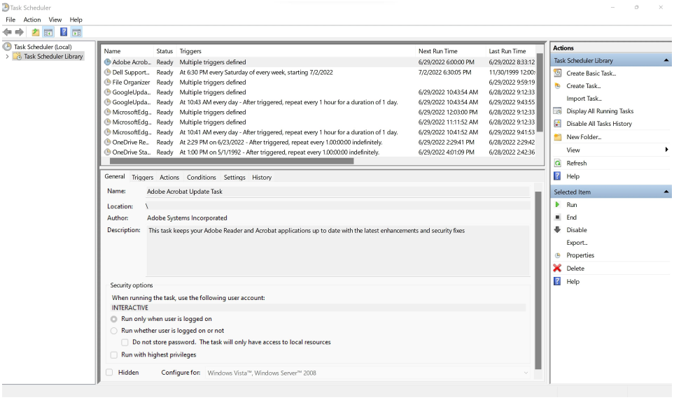
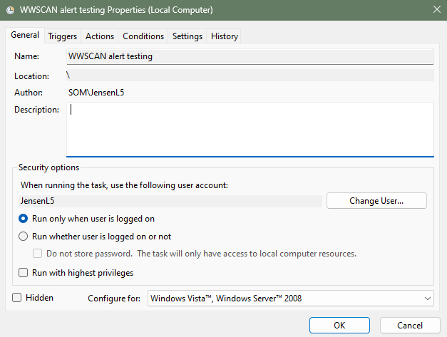
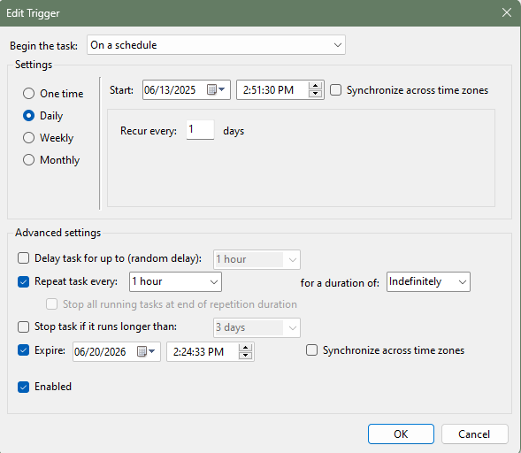
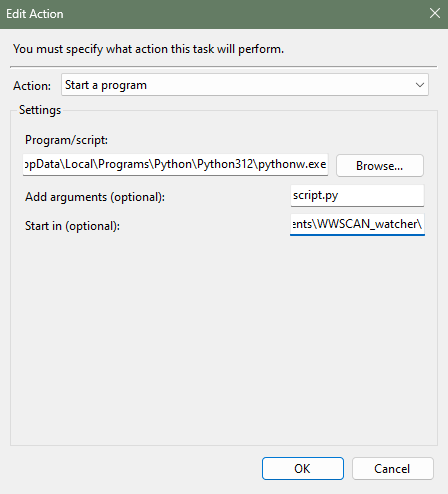
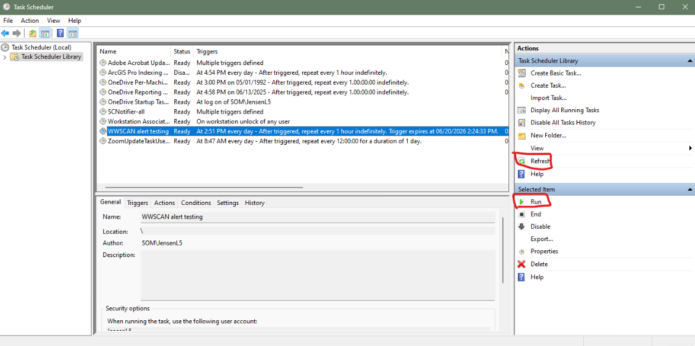

# WastewaterSCAN Watcher

## Overview

This script automates the process of monitoring new WastewaterSCAN (WWSCAN) measles detections in Michigan. It fetches the latest data, compares it to previously saved WWSCAN data, identifies new detections, saves results, and sends an email alert if new detections are found. 

## Tools Needed

- Python 3.x
- Windows PowerShell
- Windows Task Scheduler

## Step-by-Step Breakdown

### 1. Load the Most Recent Locally-Saved WWSCAN Data

The script looks for existing data files in the folder and sorts them by creation time. If no files are found, it creates an empty table with the expected columns. If files exist, it loads the most recent one and filters it to only include rows where measles was detected (MeV_gc_g_dry_weight > 0).

### 2. Fetch the Latest Michigan Data from the WWSCAN API

The script downloads the latest Michigan measles data from the WWSCAN API. The filtered Michigan data is saved to a file called latest_WWSCAN_data.csv for human review.

### 3. Identify New Measles Detections

The script filters the latest data to only include rows where measles was detected. It compares these new detections to the previous local data to find any new cases that weren’t already recorded. This is done using a merge operation, keeping only rows that are present in the new data but not in the old data.

### 4. Alert if New Detections Are Found

If any new detections are found:
- They are saved to a dated file in the detections folder.
- A PowerShell script (email_alert.ps1) is run to send an email alert.

### 5. Update Locally-Saved WWSCAN Data File

The script saves the latest Michigan data to a new file in the data folder, using the most recent sample date in the filename. To save disk space, the script keeps only the three most recent data files in the folder and deletes the rest.

## Notes for Other Jurisdictions:

- API URL: You must fill in the WWSCAN api url for the script to work.
- Folder Existence: Make sure the data and detections folders exist, or add code to create them if missing.
- Email Script: The PowerShell script for sending emails must be present and configured.

--- 
---

# script.py README

## Features

- **Fetches latest data** from the WWSCAN API.
- **Filters** for Michigan-specific and Measles-positive samples.
- **Compares** new data with the most recent local data to identify new detections.
- **Saves** new detections and updates local data files.
- **Sends email alerts** via a PowerShell script if new detections are found.
- **Manages local storage** by keeping only the three most recent data files.

## File Outputs

- `latest_WWSCAN_data.csv`: Most recent Michigan-specific data from the WWSCAN API.
- `detections/YYYYMMDD.csv`: New detections identified in the latest data, added to a folder containing all detections.
- `data/WWSCAN_YYYYMMDD.csv`: Updated local data file with the latest Measles-specific Michigan data. Note: the date in the filename refers to the most recent *sampling* date. 

## Python Libraries

- pandas
- requests

## Requirements

1. Place the script in your working directory.
2. Ensure the `data` and `detections` folders exist.
3. Update the `username` variable in the script to match your Windows username.
4. Update the `folder_path` variable to match your path.
5. Input your WWSCAN API url in the `api` variable.
6. Replace all state references from "Michigan" to your state. 
7. Ensure `email_alert.ps1` (PowerShell script for email alerts) is present.

## Notes

- The python script keeps only the three most recent local data files to save space.
- Email alerts are sent only if new detections are found.
- Make sure you have the necessary permissions to run PowerShell scripts.

---
---

# email_alert.ps1 README

This PowerShell script (`email_alert.ps1`) is designed to send automated email alerts when new measles detections are found in Michigan.

## Features

- Sends an email alert to multiple recipients.
- Attaches a CSV file containing detection details, with the filename based on the current date.
- Customizable sender, recipients, subject, and body.
- Uses the `Send-MailMessage` cmdlet and a specified SMTP server.

## Requirements 

1. Edit the directory portion of the `attachmentPath` parameter. 
2. Configure the `$from`, `$to`, and `$smtpServer` parameters.
3. The script expects a CSV file named with today's date (e.g., `20240613.csv`) in the `WWSCAN_watcher\new_detects\` directory.

## Parameters

- **$date**: Current date in `yyyyMMdd` format, used for the attachment filename.
- **$attachmentPath**: Path to the CSV file to attach.
- **$from**: Sender's email address.
- **$to**: Array of recipient email addresses.
- **$subject**: Email subject line.
- **$body**: Email body content.
- **$smtpServer**: SMTP server for sending the email (contact your health department IT for the server for your health department)

---
---

# Task Scheduler README

This tutorial will outline the steps needed to schedule WWSCAN_watcher to run every hour. Windows Task Scheduler is a built-in tool that allows users to automate tasks on their Windows machine. To create the WWSCAN_watcher task, take the following steps:

- Open Task Scheduler

- Create task on the upper right.

- Name the task 

- Add a description (optional)

- Add trigger to begin the task on a schedule; input your desired schedule

- Add action

  - "Program/script": paste your computer's path to python. For me, that's `C:\Users\jensenl5\AppData\Local\Programs\Python\Python312\pythonw.exe`. Note that it's important to include the 'w' in "pythonw.exe".

  - "Start in (optional)": paste the path to your script directory. For me, that's `C:\Users\jensenl5\Documents\WWSCAN_watcher\`

  - "Add arguments (optional)": paste the name of your script `script.py`

- You're done! You can run the task manually by clicking "run" and you can check when's the last time the code ran by clicking "Refresh"

---
## Author

    Lillian Jensen, MPH
    jensenl5@michigan.gov
    CSTE Applied Epidemiology Fellow
    Michigan Department of Health and Human Services
